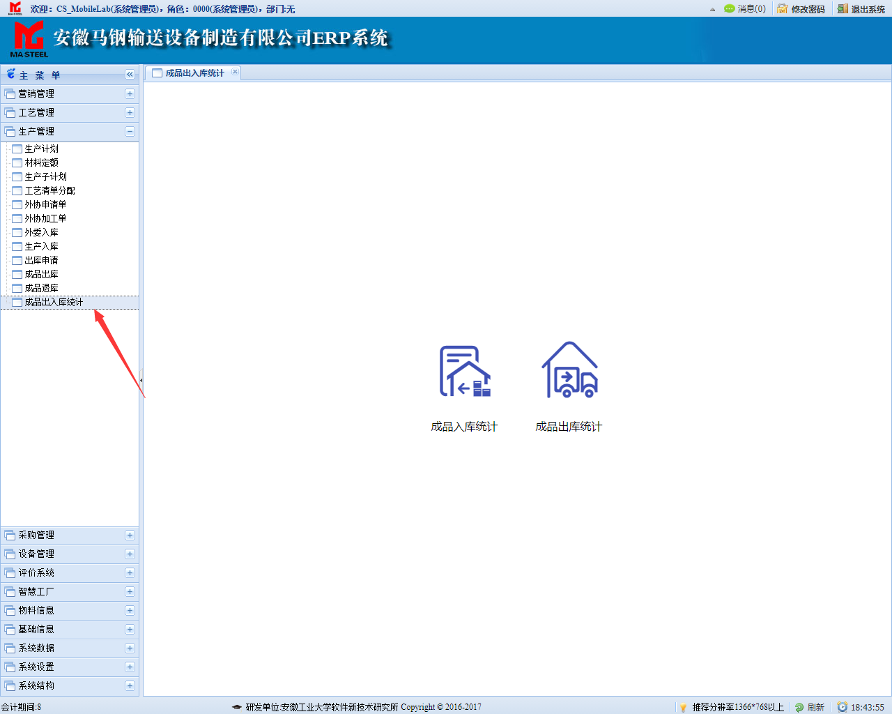
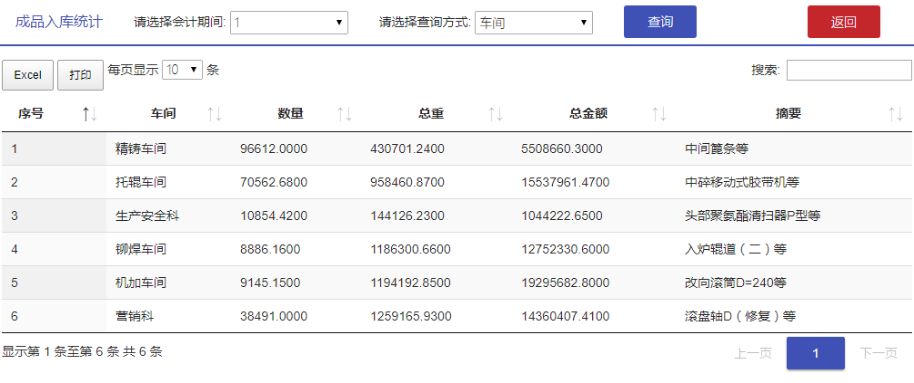
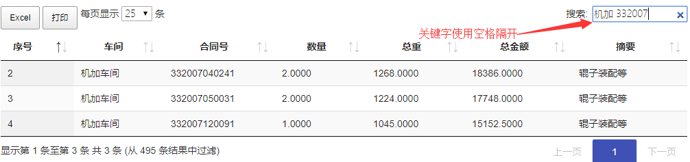
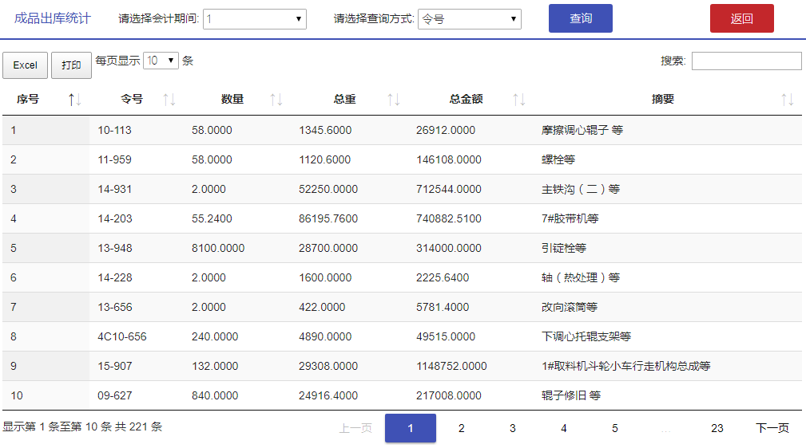
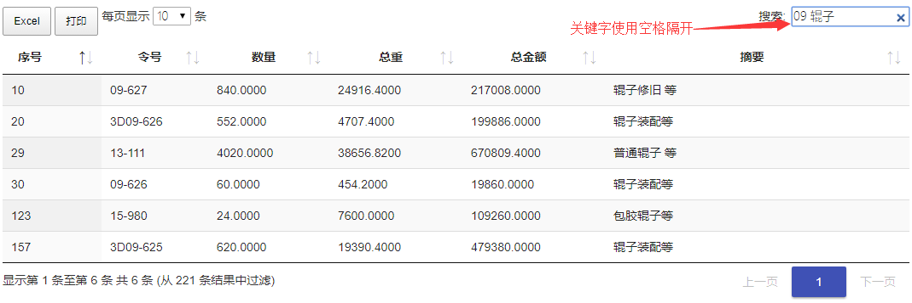

# 成品出入库统计

## 菜单首页

依次点击主菜单下的【生产管理】-->【成品出入库统计】进入到菜单首页

点击菜单首页上的``成品入库统计``或``成品出库统计``进入到相应的页面

## 成品入库统计

本页面初始显示会计期间为1，查询方式为"车间"的数据，点击“查询”按钮查询数据，点击"返回"按钮返回上一级。

该页面含有多个功能按钮：

点击"Excel"导出Excel，点击"打印"打印当前表格中数据

每页显示条数可以选择每页显示的条数，包括10、25、50、100

搜索框支持多关键字搜索，关键字之间使用空格隔开,示例如下。

点击页码显示不同页。

## 成品出库统计

本页面初始显示会计期间为1，查询方式为"令号"的数据，点击“查询”按钮查询数据，点击"返回"按钮返回上一级。

该页面含有多个功能按钮：

点击"Excel"导出Excel，点击"打印"打印当前表格中数据

每页显示条数可以选择每页显示的条数，包括10、25、50、100

搜索框支持多关键字搜索，关键字之间使用空格隔开,示例如下。

