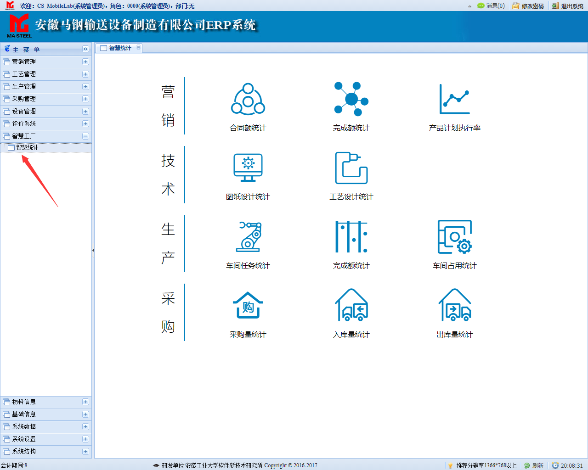
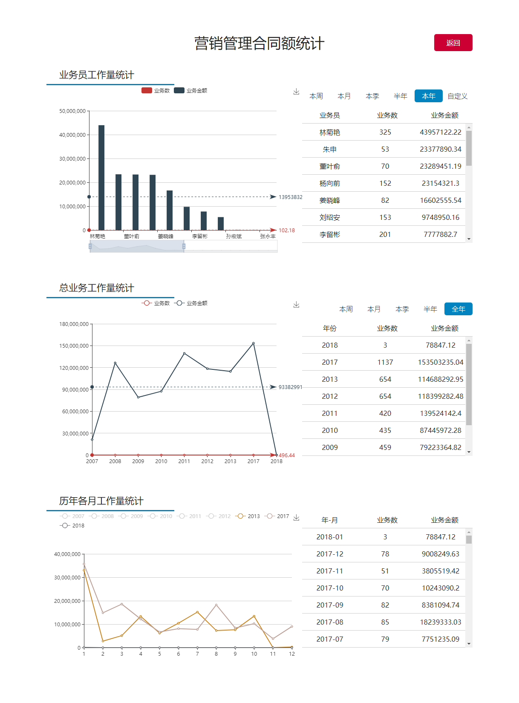
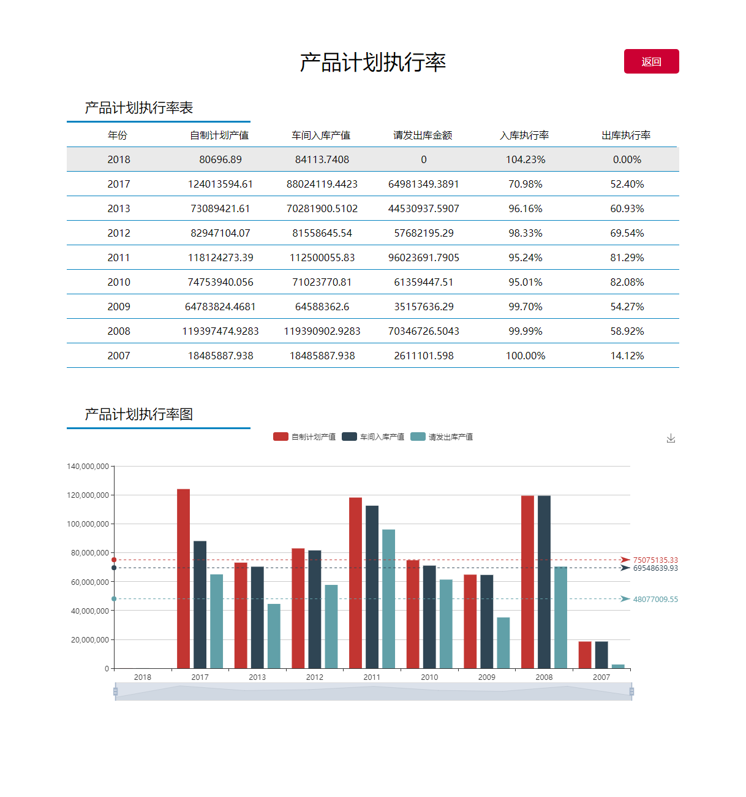
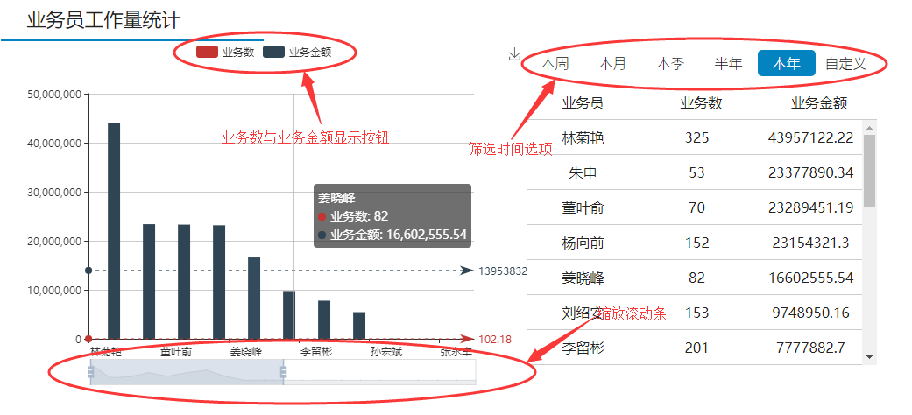
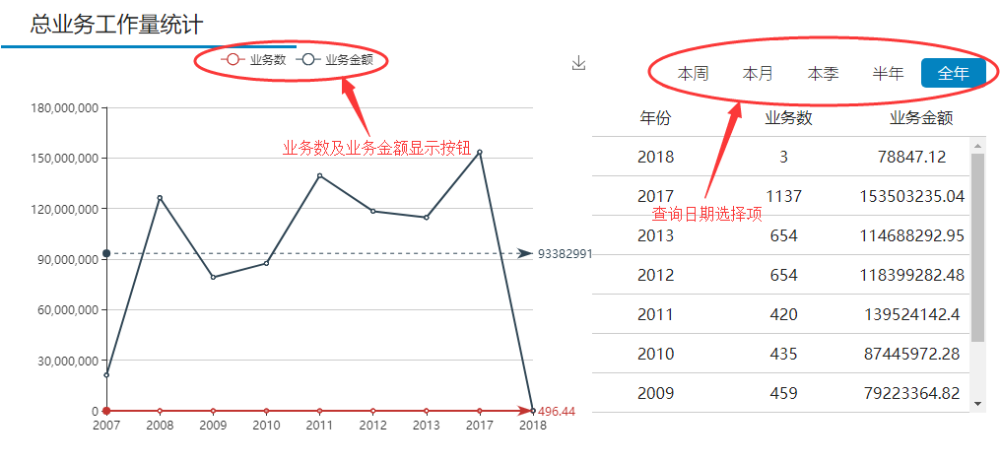
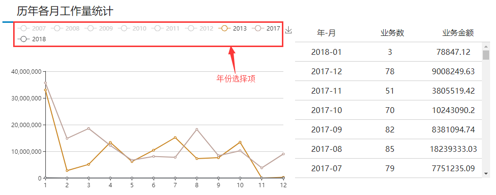
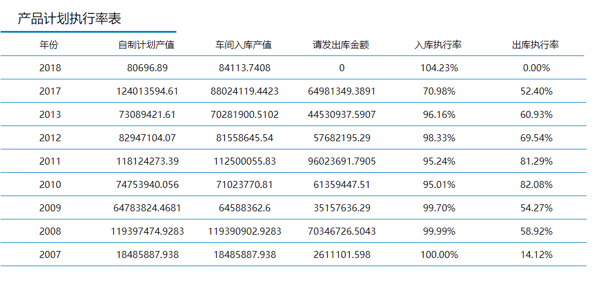
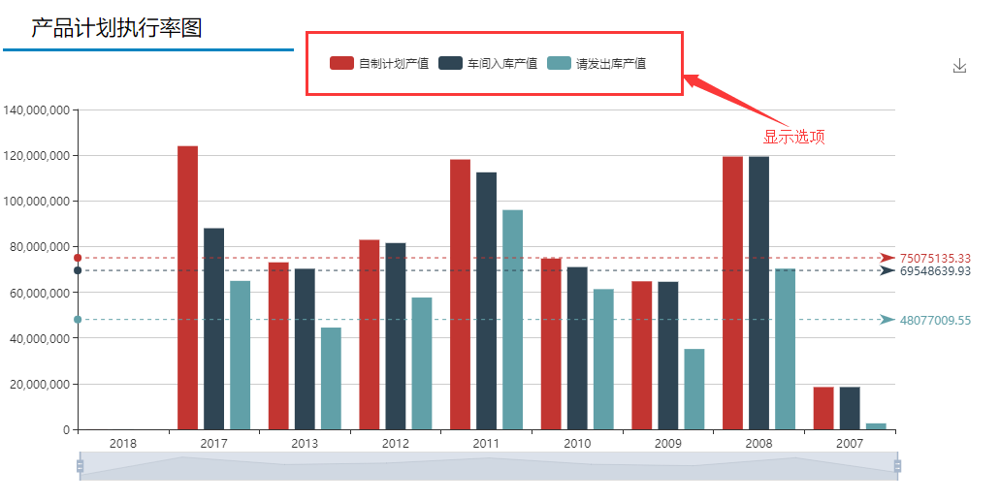

# 智慧工厂页面操作说明

## 菜单首页

进入ERP主页以后，依次点击主菜单下的【智慧工厂】-->【智慧统计】,即可进入智慧工厂首页



主内容由四大部分组成，分别为:【营销】、【技术】、【生产】、【采购】,四个主菜单分别包含两到三个子菜单，点击不同的子菜单即可进入到相应的统计页面中。

## 数据统计

智慧统计模块中，统计样式分为两种，一种是三层数据统计，包括

**营销**模块中的``合同额统计``、``完成额统计``

**技术**模块中的``图纸设计统计``、``工艺设计统计``

**生产**模块中的``车间任务统计``、``完成额统计``、``车间占用统计``

**采购**模块中的``采购量统计``、``入库量统计``、``出库量统计``打开后的样式为(以合同额统计为例)



第二种包括**营销**模块中的``产品计划执行率``，打开后的样式为:


### 三层数据统计

位于页面头部的深红色**返回** 按钮即 为返回主菜单页按钮，点击即为返回主菜单页,示例如下。
 


该页面分为三个模块，分别为**业务员工作量统计**、**总业务工作量统计**、**历年各月工作量统计**。


该模块各包含两个部分，左侧为图标部分，右侧为表格部分，左侧图表包括三部分，由上至下依次为``图表显示选项``、``图表主体``、``图表缩放按钮``,点击**筛选时间选项**中的任意时间选项会引起表格及图标中的数据变化，默认加载**本年**数据,点击自定义按钮会弹出如下自定义日期选择框，点击不同的筛选条件会显示不同时期的数据。


点选日历上的日期即可选择相应的日期，点击位于结束日期输入框右侧的``今天``按钮默认选择当前的日期，格式为yyyy-mm-dd,再次点击确认按钮，即可查询自定义日期，点击取消按钮自定义时间框消失。

```
数据说明：
1.选择“本年”，表格中的数据表示当前年份的数据与往年的数据对比
2.选择“本周”、“本月”、“本季”、“半年”，“自定义”表格中的数据表示今年与往年同时期的数据对比，例如“本月”则表示今年与往年在当前月份的数据对比。
```

第二部分同样包含有两个模块,图示如下



通过点选``业务数与业务金额显示按钮``可以选择显示业务数或者业务金额或者两者同时显示，当按钮都为灰色时即为都不显示，默认两者同时显示。*由于业务数相比于业务金额太小，业务数在图表显示上近似于水平直线*，与第一部分相同，点选``查询日期选择项``中的各个选项，会显示不同时期的数据。

```
数据说明:
1.点选“全年”显示今年与往年的总业务量数据
2.点选“本周”、“本月”、“本季”、“半年”，显示同时期当前年与往年在所选时期的数据对比，图表展示为折线图，例如选择“本周”则展示今年与往年在当前周的数据对比。
```

第三部分为总工作量按年-月形式统计，图示如下



通过点选``年份选择项``中的各项年份按钮，可以显示各项年份在图表中的显示情况，默认显示有记录的最近三年。

```
数据说明：
1.表格中时间展示格式为yyyy-mm，图表中用于展示历年各月的数值。
2.可以通过选择具体的年份来展示要显示的年份。
```

### 产品计划执行率统计

产品计划执行率包括两大部分，从上至下依次为``产品计划执行率表``、``产品计划执行率图``，

产品计划执行率表展示如下:



表格展示了历年``自制计划产值``、``车间入库产值``、``请发出库金额``、``入库执行率``、``出库执行率``

产品计划执行率图展示如下:


